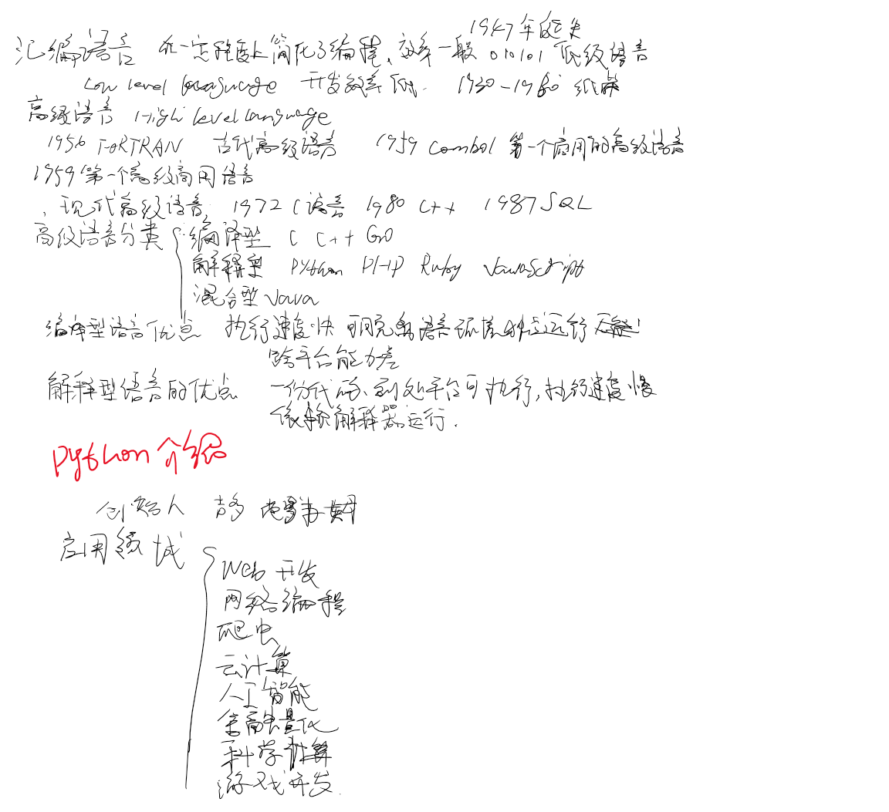
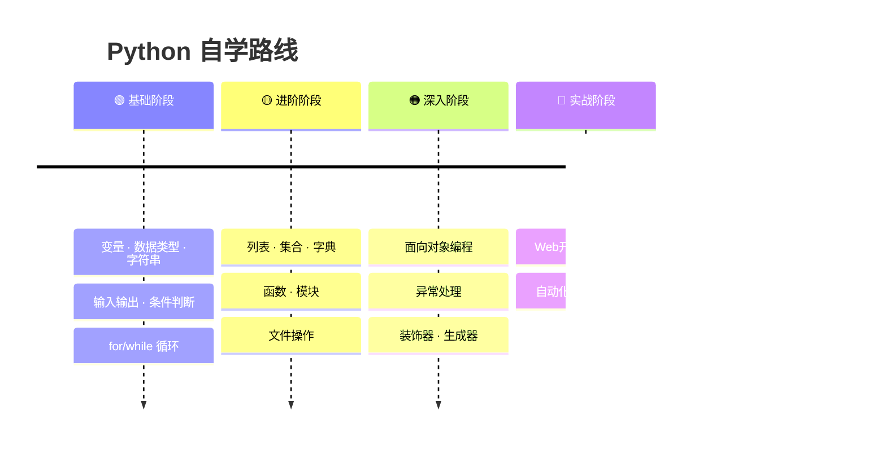

<div align="center">

# 🐍 Python 自学之旅


> **人生苦短，我用 Python。**  
> *从零开始的 Python 自学成长记录*

[](https://github.com/Chaniug/Python_Learn/commits/master)
[](https://github.com/Chaniug/Python_Learn)
[](https://github.com/Chaniug/Python_Learn/stargazers)
[](https://www.python.org/)
[](LICENSE)
[](https://github.com/Chaniug/Python_Learn/pulls)

</div>

---

<!-- ===== 项目简介 ===== -->
<div align="center">

## 📖 项目简介

</div>

<table>
<tr>
<td width="65%">

这是我日常学习 Python 的代码仓库，记录了从 **零基础自学 Python** 的完整成长轨迹。

仓库主要内容涵盖：

- 📘 **Python 基础语法** — 变量、数据类型、字符串操作、输入输出
- 📚 **教材课后习题** — 分章节整理的课本配套练习
- 💻 **在线直播课作业** — 实战项目：抽奖系统、扑克牌比大小等
- 🧪 **日常代码测试** — 各种知识点的验证与探索代码
- 📝 **学习笔记** — 重点知识总结与疑难点突破

> 由于是自学，体系内容可能不是特别完整，但会持续更新。  
> 欢迎各位大佬提意见与建议 🙏

</td>
<td width="35%" align="center">


**Python 3.x**  
<sub>简单 · 优雅 · 强大</sub>

</td>
</tr>
</table>

---

<!-- ===== 为什么选择 Python ===== -->
<div align="center">

## 🧠 为什么选择 Python？

</div>

<div align="center">

| 🎯 | 💡 | 🌟 |
|:---:|:---:|:---:|
| **语法简洁** | **生态庞大** | **应用广泛** |
| 上手快，可读性强 | Web/AI/数据科学全覆盖 | 从脚本到机器学习无所不能 |
| 适合编程入门 | 成熟框架与社区支持 | 自动化办公到工业级项目 |

</div>

<br>

> 💬 **有人问**：自学的难度比较大，为什么还会坚持学习？  
> 🤔 **我想说**：学习的目的是为了提高自己的能力。在社会的大环境中不断充实自己，时刻保持自己的竞争力，充分利用自己的所学解决问题。  
> 🚀 在高速发展的 **AI 时代**，我们更加需要不断学习，提升自己的竞争力，不被社会淘汰。

---

<!-- ===== 学习进度 ===== -->
<div align="center">

## 📊 学习进度

</div>

<div align="center">

| 阶段 | 知识点 | 状态 | 进度 |
|:---:|:-------|:----:|:----:|
| 🟢 | **基础语法** — 变量、数据类型、字符串、输入输出 | ✅ 已完成 |  |
| 🟢 | **流程控制** — 条件判断、循环 | ✅ 已完成 |  |
| 🟢 | **数据结构** — 列表、集合、字典 | ✅ 已完成 |  |
| 🟡 | **函数与模块** — 自定义函数、模块导入 | 🔄 进行中 |  |
| 🟠 | **文件操作** — 读写文件、上下文管理器 | ⏳ 待开始 |  |
| 🟠 | **面向对象** — 类、继承、封装、多态 | ⏳ 待开始 |  |
| 🔴 | **进阶主题** — 异常处理、装饰器、生成器 | ⏳ 待开始 |  |
| 🔴 | **项目实战** — Web / 数据分析 / 自动化 | ⏳ 待开始 |  |

</div>

---

<!-- ===== 目录结构 ===== -->
<div align="center">

## 📂 项目导航 · 目录结构

</div>

<table>
<tr>
<th colspan="3" align="center">📁 Python_Learn /</th>
</tr>
<tr>
<td width="33%">

**🐍 Code /** — 核心代码
- 📁 **OnlieTask/** — 在线直播课作业
  - 📄 `chou_jiang.py` — 年会抽奖系统
  - 📄 `choujaing.py` — 抽奖系统(30人版)
  - 📄 `sa.py` — 待完善
  - 📄 `uytt.py` — 随机数生成
- 📁 **TaskFile/** — 教材课后习题
  - 📁 **2unit/** — 第2单元·基础语法
  - 📁 **3unit/** — 第3单元·列表与循环
  - 📁 **4unit/** — 第4单元·高级主题
- 📁 **TestFile/** — 日常代码测试
  - 🧪 变量 / 字符串 / 集合 / API 调用...

</td>
<td width="33%">

**📝 Note /** — 学习笔记
- 📁 **write_note/** — 重点笔记(图片)
  - 🖼️ `Python基础.png`
  - 🖼️ `3-3题库.png`

**🖼️ image /** — 仓库用图
- 📄 `python-logo@2x.png`

</td>
<td width="33%">

**📄 根目录文件**
- 📄 `main.py` — 项目启动入口
- 📄 `README.md` — 本文件
- 📄 `.gitignore` — Git 忽略规则
- 📄 `requirements.txt` — 依赖管理

</td>
</tr>
</table>

---

<!-- ===== 仓库内容速览 ===== -->
<div align="center">

## 🗂️ 仓库内容速览

</div>

<!-- 学习笔记卡片 -->
<div align="center">

### 📝 学习笔记

</div>

<table>
<tr>
<td width="40%" align="center">


<sub>📌 Python 基础知识点梳理</sub>

</td>
<td width="60%">

> 路径：[📂 Note/write_note/](https://github.com/Chaniug/Python_Learn/tree/master/Note/write_note)

涵盖学习中的重点知识细节讲解、疑难点突破，包含基础语法、代码规范、错误演示等内容。

| 笔记文件 | 内容说明 |
|:---------|:---------|
| 🖼️ `Python基础.png` | 基础知识点全览（变量、数据类型、运算符等） |
| 🖼️ `3-3题库.png` | 第三章课后习题详细解析 |

> 📢 目前以图片形式保存，后续会逐步补充 Markdown 文字版笔记，方便阅读和检索。

</td>
</tr>
</table>

<br>

<!-- 课本习题卡片 -->
<div align="center">

### 📘 课本习题作业

</div>

<table>
<tr>
<td width="60%">

> 路径：[📂 Code/TaskFile/](https://github.com/Chaniug/Python_Learn/tree/master/Code/TaskFile)

| 单元 | 核心内容 | 文件数 | 状态 |
|:---:|:---------|:-----:|:----:|
| **第2单元** | 基础语法、变量、字符串格式化 | 6 | ✅ 进行中 |
| **第3单元** | 列表操作、for 循环、zip() | 3 | ✅ 进行中 |
| **第4单元** | 循环嵌套、列表遍历 | 1 | 🔄 更新中 |

**🔑 代表代码片段：**

```python
# 第2单元 - f-string 字符串格式化
Onename = "Eric"
print(f"{Onename}, would you like to learn Python today?")

# 第3单元 - zip() 并行遍历
names = ["chang", "yang", "liu", "zhou", "wang"]
vehicles = ["bus", "plane", "steamboat", "train", "bicycle"]
for i, j in zip(names, vehicles):
    print(f"{i.title()}同学，喜欢{j.title()}出行。")

# 第4单元 - for 循环遍历
magics = ['jeasm', 'yuki', 'mike', 'john', 'wohn']
for magices in magics:
    print(f'{magices.title()}是最好的魔术师！')
```

</td>
<td width="40%" align="center">


**📁 Code/TaskFile/**  
<sub>分单元 · 循序渐进</sub>

</td>
</tr>
</table>

<br>

<!-- 在线直播课作业卡片 -->
<div align="center">

### 💻 在线直播课作业 · 实战项目

</div>

<table>
<tr>
<td width="40%" align="center">

| 项目 | 状态 |
|:----|:----:|
| 🎁 年会抽奖系统 | ✅ 完成 |
| 🎁 抽奖系统优化版 | ✅ 完成 |
| 🃏 扑克牌比大小 | ✅ 完成 |

</td>
<td width="60%">

> 路径：[📂 Code/OnlieTask/](https://github.com/Chaniug/Python_Learn/tree/master/Code/OnlieTask)

**🔑 项目亮点：**

```python
# 年会三级抽奖系统
for j in range(3):
    winner_list = random.sample(employees, prize_levels[j])
    print(f"恭喜获得{3-j}等奖:", winner_list)
    for winner in winner_list:
        employees.remove(winner)
```

```python
# 扑克牌比大小（用户 vs 电脑）
if faces.index(user_face) > faces.index(computer_face):
    print("🎉 你赢了!")
elif faces.index(user_face) < faces.index(computer_face):
    print("😢 你输了...")
```

</td>
</tr>
</table>

<br>

<!-- 日常代码测试卡片 -->
<div align="center">

### 🧪 日常代码测试

</div>

<table>
<tr>
<td width="60%">

> 路径：[📂 Code/TestFile/](https://github.com/Chaniug/Python_Learn/tree/master/Code/TestFile)

| 分类 | 知识点 | 文件 |
|:----|:-------|:-----|
| 🔤 **基础** | 变量、运算符、输入输出 | `变量的使用.py`, `02.py` |
| 📝 **字符串** | f-string、切片、方法 | `字符串操作.py`, `变量字符串的使用.py` |
| 🔢 **数据类型** | 复数 complex | `字符类型.py` |
| 🧮 **集合** | 交集&、并集\|、差集- | `day1.py` |
| 🔄 **推导式** | 列表推导式 | `test.py` |
| ✖️ **循环** | 九九乘法表(一行代码) | `chengfa.py` |
| 🤖 **AI** | 通义千问 API 调用 | `ainle.py` |
| 🌐 **自动化** | Selenium Edge 下载 | `filketx.py` |

</td>
<td width="40%">

**🔑 经典代码：**

```python
# 一行写出九九乘法表
print('\n'.join([' '.join(
    [f"{j}x{i}={i*j}" for j in range(1, i+1)]
) for i in range(1, 10)]))
```

输出的结果：
```
1x1=1
1x2=2 2x2=4
1x3=3 2x3=6 3x3=9
...
```

</td>
</tr>
</table>

---

<!-- ===== 技术栈 ===== -->
<div align="center">

## 🛠️ 技术栈

</div>

<div align="center">

| | 技术 | 用途 |
|:---:|:-----|:-----|
|  | **Python 3.x** | 主编程语言 |
| 🎲 | **random** (标准库) | 抽奖、扑克牌洗牌 |
| 🐢 | **turtle** (标准库) | 基础图形绘制 |
| 🌐 | **selenium** | Web 自动化 (Edge) |
| 🤖 | **openai** | 通义千问 API 调用 |

</div>

---

<!-- ===== 快速开始 ===== -->
<div align="center">

## 🚀 快速开始

</div>

<details>
<summary><b>📋 点击展开完整步骤</b></summary>

<br>

```bash
# 1. 克隆仓库
git clone https://github.com/Chaniug/Python_Learn.git

# 2. 进入项目目录
cd Python_Learn
```

```bash
# 3. （可选）创建虚拟环境
python -m venv venv

# Windows 激活虚拟环境
venv\Scripts\activate
```

```bash
# 4. 安装依赖
pip install -r requirements.txt
```

```bash
# 5. 运行交互式菜单（推荐）
python main.py
```

```bash
# 6. 或者直接运行某个项目
python Code/TestFile/Day_stu_file.py    # 年会抽奖
python Code/TestFile/pokerank.py        # 扑克牌比大小
python Code/TestFile/chengfa.py         # 九九乘法表
```

</details>

<br>

<!-- ===== 学习路线图 ===== -->
<div align="center">

## 🗺️ 学习路线图

</div>



---

<!-- ===== 贡献指南 ===== -->
<div align="center">

## 🤝 贡献指南

</div>

<div align="center">

欢迎任何形式的贡献！如果你有好的建议或发现了错误：

| 步骤 | 操作 |
|:----:|:-----|
| 1️⃣ | 提交 [💬 Issue](https://github.com/Chaniug/Python_Learn/issues) 讨论 |
| 2️⃣ | Fork 本仓库并创建新的分支 |
| 3️⃣ | 提交 [🔀 Pull Request](https://github.com/Chaniug/Python_Learn/pulls) |

</div>

---

<!-- ===== 联系我 ===== -->
<div align="center">

## 📬 联系我

</div>

<div align="center">

| | |
|:----|:----|
| 👤 **作者** | chaniug |
| 📧 **邮箱** | [chaniug@vip.qq.com](mailto:chaniug@vip.qq.com) |
| 🐙 **GitHub** | [@Chaniug](https://github.com/Chaniug) |

</div>

---

<!-- ===== Footer ===== -->
<div align="center">

---

⭐ **如果这个仓库对你有帮助，欢迎 Star 支持！**  

> **持续学习 · 持续成长 · 永不止步**  
> *Keep Learning, Keep Growing, Never Stop*

---

<sub>📅 最后更新: 2026-06-22 | 🐍 Python 自学之旅正在进行中...</sub>

</div>

